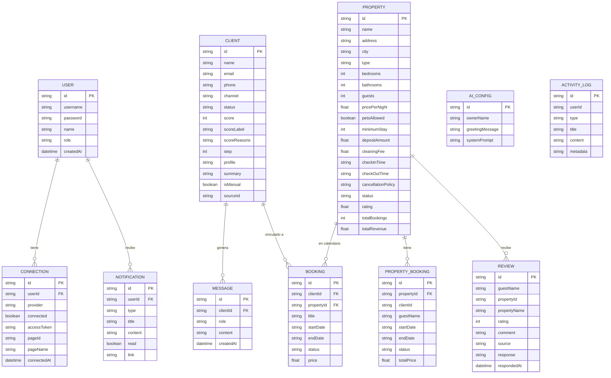
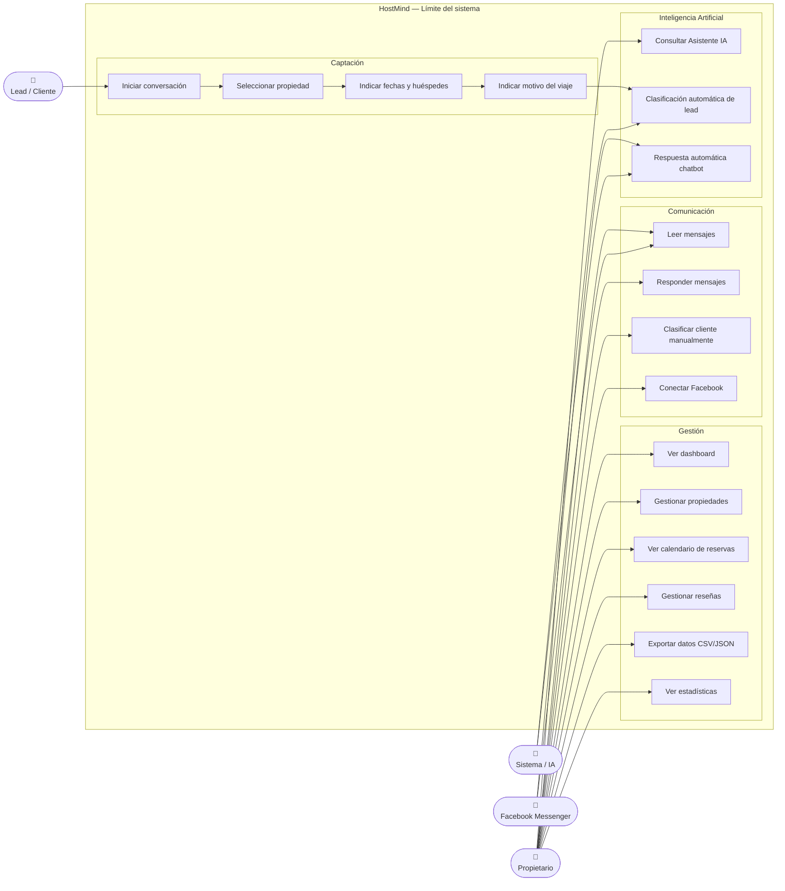
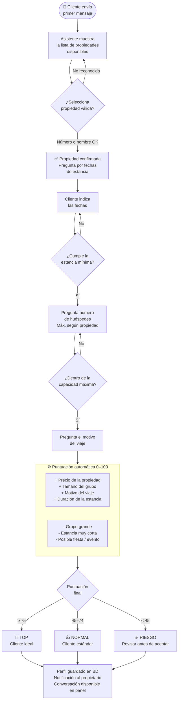
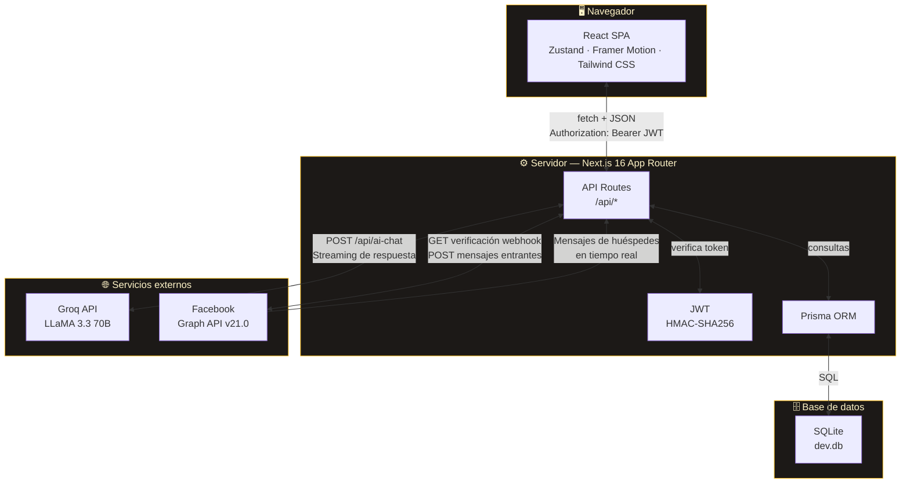

# HostMind — Diagramas técnicos

> Renderizar en [mermaid.live](https://mermaid.live) → pegar el código → captura de pantalla.  
> GitHub también los renderiza automáticamente al subir el archivo.

---

## 1. Diagrama Entidad-Relación (ER)

Representa las tablas de la base de datos y sus relaciones.

---

## 2. Diagrama de Casos de Uso

Muestra los actores del sistema y las acciones que puede realizar cada uno.

---

## 3. Diagrama de Flujo UX — Chatbot de captación

Representa el recorrido completo de un lead desde el primer mensaje hasta su clasificación.

---

## 4. Diagrama de Arquitectura

Muestra cómo se comunican todas las capas del sistema.

---

## Cómo exportar como imágenes

1. Ir a [mermaid.live](https://mermaid.live)
2. Pegar el bloque de código de cada diagrama (sin las triple comillas)
3. En la esquina superior derecha: **Actions → Download PNG** o **Download SVG**
4. Renombrar los archivos:
   - `diagrama_er.png`
   - `diagrama_casos_uso.png`
   - `diagrama_flujo_ux.png`
   - `diagrama_arquitectura.png`
"# Diagrama" 
