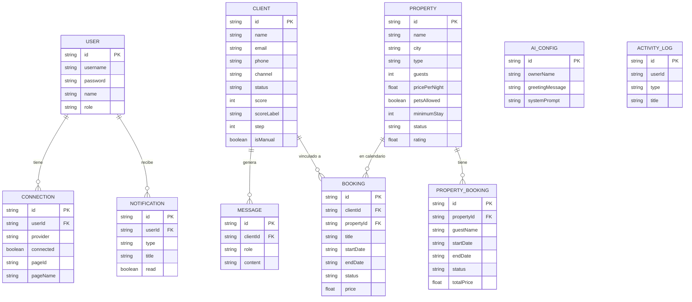
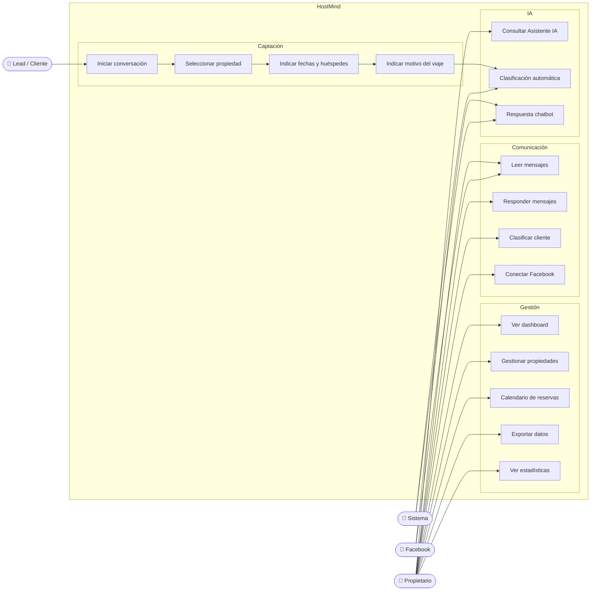
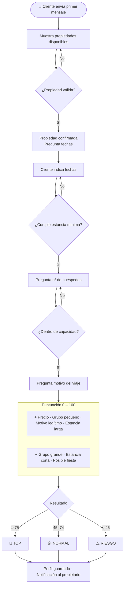
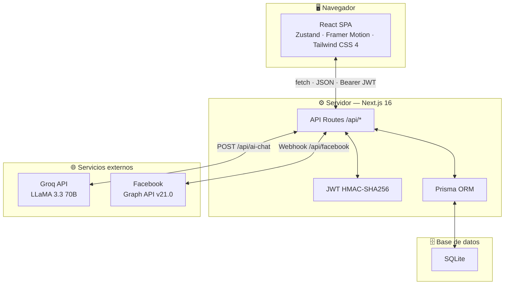

# HostMind

**Plataforma SaaS de gestión de alojamientos turísticos**

HostMind centraliza la gestión de propiedades, reservas, clientes y comunicación en un único panel de control. Incluye un chatbot de captación y clasificación de leads, integración con Facebook Messenger y un asistente con acceso a los datos reales del negocio.

---

## Funcionalidades

| Módulo | Descripción |
|---|---|
| **Dashboard** | Métricas en tiempo real: ingresos, ocupación, actividad reciente |
| **Propiedades** | Alta, edición y gestión con precios, normas, amenities, check-in/out y depósito |
| **Calendario** | Vista mensual de reservas por propiedad |
| **Clientes / Leads** | Clasificación automática TOP / NORMAL / RIESGO con historial de mensajes |
| **Mensajes** | Bandeja integrada con Facebook Messenger |
| **Chatbot** | Flujo de 5 pasos para captar y cualificar leads sin dependencias externas |
| **Asistente IA** | Chat interno con acceso a los datos reales del negocio (Groq / LLaMA) |
| **Conectividad** | Integración con Facebook Messenger vía webhook |
| **Exportación** | Clientes, reservas e ingresos en CSV o JSON |

---

## Tecnologías

| Capa | Tecnología |
|---|---|
| Framework | Next.js 16 — App Router |
| Lenguaje | TypeScript |
| Estilos | Tailwind CSS 4 + shadcn/ui |
| Base de datos | SQLite (Prisma ORM) |
| Estado global | Zustand |
| Animaciones | Framer Motion |
| Autenticación | JWT (HMAC-SHA256, implementación propia) + bcrypt |
| IA | Groq API — llama-3.3-70b-versatile |
| API externa | Facebook Graph API v21.0 |

---

## Instalación

```bash
# 1. Instalar dependencias
npm install

# 2. Configurar variables de entorno
cp .env.example .env        # Linux / macOS
copy .env.example .env      # Windows

# 3. Inicializar la base de datos
npm run db:push

# 4. Arrancar en desarrollo
npm run dev
```

Abre **http://localhost:3000**

### Variables de entorno

```env
DATABASE_URL="file:./dev.db"
AUTH_SECRET=""           # genera con: node -e "console.log(require('crypto').randomBytes(64).toString('hex'))"
GROQ_API_KEY=""          # https://console.groq.com
FACEBOOK_WEBHOOK_VERIFY_TOKEN=""
```

---

## Cuentas

| Usuario | Contraseña | Descripción |
|---|---|---|
| `owner` | `owner123` | Demo completo — 4 propiedades, 10 clientes y reservas de ejemplo |
| `admin` | `admin123` | Cuenta limpia — borra todos los datos de demo al iniciar sesión |

---

## Comandos

```bash
npm run dev          # Desarrollo  →  http://localhost:3000
npm run build        # Build de producción
npm start            # Servidor de producción
npm run db:push      # Sincronizar esquema de BD
npm run db:reset     # ⚠️  Borrar y recrear la base de datos
```

---

## Diagramas

### Entidad-Relación (BD)



---

### Casos de uso



---

### Flujo UX — Chatbot de captación



---

### Arquitectura del sistema



---

## Autor

**Nicolás Silva Cremona**  
Desarrollo de Aplicaciones Web (DAW) — Grado Superior  
IES Playamar · Curso 2025–2026  
nsilcre432@g.educaand.es
